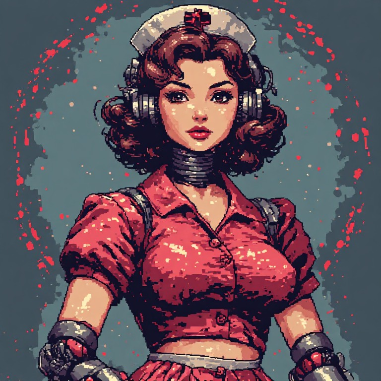

[](https://x.com/NorowaretaGemu)
[](https://opensource.org/licenses/MIT)

<div align="center">
  <a href="https://ko-fi.com/cursedentertainment">
    
  </a>
</div>
<div align="center">
  
  
</div>
<div align="center">
  
</div>

---

# NINA
## Network Inspector & Notification Assistant

- Robot Type: Caretaker (software, runs on the PC beside RIFT)

<div align="center">
  
  <p><i>NINA</i></p>
</div>

**Site:** [cursedprograms.github.io/NINA](https://cursedprograms.github.io/NINA/)

The fleet's caretaker. NINA watches every robot and says what's wrong, and why, before you have to go looking.

---

## What she watches

| | What | Why |
| :--- | :--- | :--- |
| **Fleet** | Every robot RIFT knows (`GET /fleet`): answering or not, and how fast | Two misses in a row = offline; she says when it's back |
| **NORA** | Her web server's speed, her uptime (`/talk` `now`), her drive mode and who changed it (`/sensors` `mode` + `msrc`) | A slow page freezes NORA's whole loop; uptime falling back means she rebooted (a power dip?); a mode change nobody made gets flagged |
| **This PC** | Which WiFi it's on | NORA "offline" often just means Windows hopped back to a network with internet |
| **Serial ports** | Ports appearing and disappearing, with a guess at which board it is | Listed only, **never opened**: opening a port resets an Arduino and fights the program that owns it |

Everything goes to her log. She says the important things out loud (Windows text-to-speech) and writes them to RIFT's mission log.

## Running

```bat
run.bat
```

`run.bat` sets up `venv` the first time, then starts NINA. Her page is at **http://127.0.0.1:5012/**.

She registers with RIFT every 10 s (`type: caretaker`, `web:5012`, `talk:5012`), so she shows up on RIFT's dashboard and in MILA's fleet list, and joins the Brainfuck conversations (`GET /chirp?u=0-13` beeps the phrase on the PC speaker, in her own pitch).

## Settings

`options.bat` opens the options menu (the same one every bot has) for `config.json`:

| Setting | Default | |
| :--- | :--- | :--- |
| `Port` | `5012` | her page and API |
| `RiftHost` / `RiftPort` | `127.0.0.1` / `5000` | where RIFT runs |
| `NoraHost` / `NoraSsid` | `192.168.4.1` / `NORA` | NORA's address and WiFi name |
| `CheckSeconds` | `5` | how often she looks |
| `SlowMs` | `2000` | slower than this is worth a warning |
| `Speak` / `Voice` / `VoicePitch` | on / Zira / `0.85` | her voice and her chirp pitch |
| `MissionLog` | on | write problems to RIFT's mission log |

## API

- `GET /status`: everything she knows (robots, NORA, WiFi, ports, recent events)
- `GET /events`: her log, newest first
- `GET /ping`, `GET /chirp?u=0-13`

## Colours

Her colours come from her avatar (`colour_scheme.xml`): slate blue-grey surfaces, her red-cross red as the accent, her crimson dress and a warm cream. Her page, her options menu and the site all use them.

## Related Projects

- [RIFT](https://github.com/CursedPrograms/RIFT)
- [NORA-Robot-v00](https://github.com/CursedPrograms/NORA-Robot-v00)
- [DREAM](https://github.com/CursedPrograms/DREAM)
- [MILA](https://github.com/CursedPrograms/MILA)

---

<br>
<div align="center">
&copy; Cursed Entertainment 2026
</div>
<br>
<div align="center">
<a href="https://cursed-entertainment.itch.io/" target="_blank">
    
</a>
</div>
